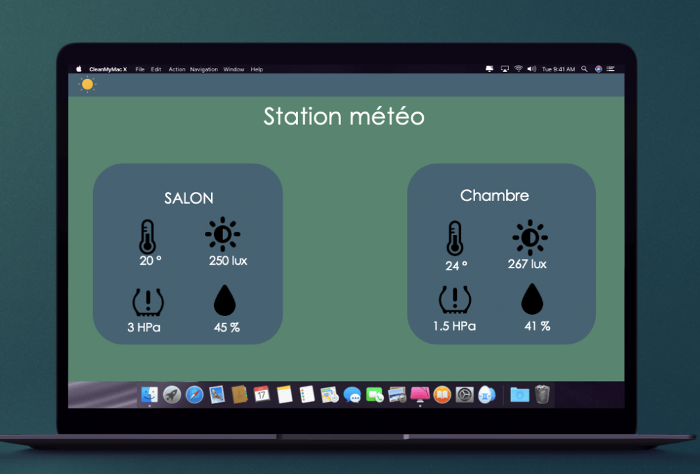

# Projet IOT - Ynov Toulouse

## Station méteo 🌀

Le but du projet va être de mettre en place une station météo permettant de récolter divers  informations comme la température, la pression de l’air, la luminosité et l’humidité.

Les données sont ensuite envoyées vers une raspberry pi qui les stockera en base de données. Un logiciel client sera disponible (site internet) pour afficher les différentes données.

## Membre du groupe 👤
▸ Delpierre Lucas  
▸ Cognard Timothée  
▸ Vasseur Raphaël  
▸ ESCOBAR Jérémy  

